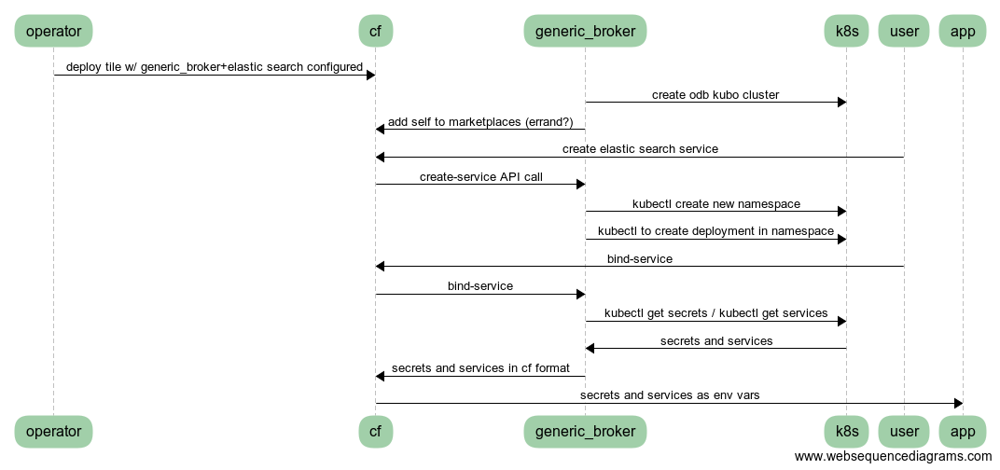

# Kibosh

A generic broker bridging the gap between Kubernetes and CF brokered services.

## Dev
#### Setup
Grab a newish version of Go (we used 1.9) 

Install Go depenencies
```bash
go get -u github.com/onsi/ginkgo/ginkgo
go get -u github.com/onsi/gomega
go get -u github.com/maxbrunsfeld/counterfeiter
go get -u github.com/golang/dep/cmd/dep
```

#### Minikube
To set things up in a way that authentication is done the same way as against PKS, run 
```bash
./dev/minikube_auth.sh
```

Which creates a service account with `cluster-admin` and output the token.

For `certificate-authority-data`, encode the minikube certificate:
```bash
cat ~/.minikube/ca.crt | base64
```

#### Dependency vendoring
Run `make bootstrap` from a clean checkout to setup initial dependencies. This will restore
the locked dependency set specified by `Gopkg.toml` (we're not longer checking in `vendor`).

To add a dependency:
```bash
dep ensure -add github.com/pkg/errors
```

To update a dependency:
```bash
dep ensure -update github.com/pkg/errors
```

Dependency vendoring wrt to helm & k8s is trickier. `dep` isn't able to build the
tree without significant help. The `Gopkg.tml` has several overrides needed to get everything
to compile (which work in conjunction with `setup-apimmachinery.sh`).

Updating to a new version of helm/k8s will probably require re-visiting the override & constraint
matrix built. Useful inputs into this process are:
* The k8s Godeps
    - https://github.com/kubernetes/kubernetes/blob/master/Godeps/Godeps.json
* Helm's Glide dependencies and dependency lock file
    - https://github.com/kubernetes/helm/blob/master/glide.yaml
    - https://github.com/kubernetes/helm/blob/master/glide.lock

More dep links:
* Common dep commands:  https://golang.github.io/dep/docs/daily-dep.html
* `Gopks.toml` details: https://github.com/golang/dep/blob/master/docs/Gopkg.toml.md

#### Test
```bash
make test
```

#### Run
```bash
make run
```

### ci
* https://concourse.cfplatformeng.com/teams/main/pipelines/kibosh

## Notes

Inline-style: 


Diagram source https://www.websequencediagrams.com/ + 
```text
object operator user cf generic_broker k8s app
operator->cf: deploy tile w/ generic_broker+elastic search configured
generic_broker->k8s: create odb kubo cluster
generic_broker->cf: add self to marketplaces (errand?)
user->cf: create elastic search service
cf->generic_broker: create-service API call
generic_broker-> k8s: kubectl create new namespace
generic_broker-> k8s: kubectl to create deployment in namespace
user->cf: bind-service
cf->generic_broker: bind-service
generic_broker-> k8s: kubectl get secrets / kubectl get services
k8s->generic_broker: secrets and services
generic_broker->cf: secrets and services in cf format
cf->app: secrets and services as env vars
```
