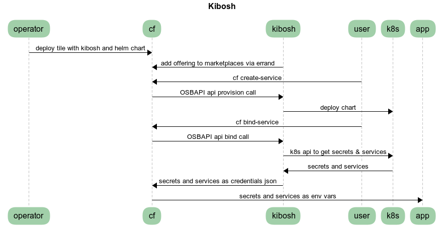

# Kibosh

An [open service broker](https://github.com/openservicebrokerapi/servicebroker)
bridging the gap between Kubernetes deployments and CF marketplace.

When deployed with a Helm chart and added to the marketplace,
* `cf create-serive` calls to Kibosh will create the collection of Kubernetes resources described by the chart.
* `cf bind-service` calls to Kibosh will expose back any services and secrets created by the chart

For some in depth discussion, see this blog post: [Use Kubernetes Helm Packages to Build Pivotal Cloud Foundry tiles](https://content.pivotal.io/blog/use-kubernetes-helm-packages-to-build-pivotal-cloud-foundry-tiles-kibosh-a-new-service-broker-makes-it-simple)

The consumer of this repo is
[tile-generator](https://github.com/cf-platform-eng/tile-generator),
which provides a packaging abstraction to produce a PCF tile from a helm chart: we BOSH so you don't have to.

We are still in early development, but do plan to provide migration for partners working directly with us.

## Configuration
### Changes required in Chart
* Plans (cf marketplace)
    Kibosh requires that helm chart has additional file that describes plan in plans.yaml at root level
    ```yaml
    - name: "small"
      description: "default (small) plan for mysql"
      file: "small.yaml"
    - name: "medium"
      description: "medium sized plan for mysql"
      file: "medium.yaml"
    ```
    `file` is a filename that exists in the `plans` subdirectory of the chart and
    `name`'s value should be lower alpha, numeric, `.`, or `-` 
    Values `values.yaml` sets the defaults and plans only need override values 

In order to successfully pull private images, we're imposing some requirements
on the `values.yaml` file structure

* Single image charts should use this structure:
    ```yaml
    ---
    image: "my-image"
    imageTag: "5.7.14"
    ```
* Multi-image charts shoud use this structure:
    ```yaml
    ---
    images:
      thing1:
        image: "my-first-image"
        imageTag: "5.7.14"
      thing2:
        image: "my-second-image"
        imageTag: "1.2.3"
    ```

### Other Requirement

* When defining a `Service`, to expose this back to any applications that are bound,
  `type: LoadBalancer` is a current requirement.
* Resizing disks has limitiations. To support upgrade:
    - You can't resize a persistent volume claim (currently behind an [alpha feature gate](https://kubernetes.io/docs/reference/feature-gates/))
* Selectors are [immutable](https://kubernetes.io/docs/concepts/workloads/controllers/deployment/#selector)
    - This means that *chart name cannot change* (the name is generally used in selectors)

### Private registries
When the environment settings for a private registry are present (`REG_SERVER`, `REG_USER`, `REG_PASS`), 
then Kibosh will transform images to pull them from the private registry. It assumes
the image is already present (see the Kibosh deployment). It will patch
the default service account in the instance namespaces to add in the registry credentials.

Be sure that `REG_SERVER` contains any required path information. For example, in gcp `gcr.io/my-project-name`

## Contributing to Kibosh

We welcome comments, questions, and contributions from community members. Please consider
the following ways to contribute:

* File Github issues for questions, bugs and new features and comment and vote on the ones that you are interested in.
* If you want to contribute code, please make your code changes on a fork of this repository and submit a
pull request to the master branch of Kibosh. We strongly suggest that you first file an issue to
let us know of your intent, or comment on the issue you are planning to address.

## Dev
#### Setup

Install Go depenencies
```bash
go get -u github.com/onsi/ginkgo/ginkgo
go get -u github.com/onsi/gomega
go get -u github.com/maxbrunsfeld/counterfeiter
go get -u github.com/golang/dep/cmd/dep
```

#### Run
Run `make bootstrap` from a clean checkout to setup initial dependencies. This will restore
the locked dependency set specified by `Gopkg.toml` (we're no longer checking in `vendor`).

Copy `local_dev.sh.template` to `local_dev.sh` (which is in `.gitignore`) and 
configure the values (`cluster.certificate-authority-data`, `cluster.server`, and `user.token`)
for a working cluster (minikube instructions below). Then run:

```bash
./local_dev.sh
```

#### Test
```bash
make test
```

To generate the test-doubles, after any interface change run: 
```bash
make generate
```

### ci
* https://concourse.cfplatformeng.com/teams/main/pipelines/kibosh

#### Dependency vendoring

To add a dependency:
```bash
dep ensure -add github.com/pkg/errors
```

To update a dependency:
```bash
dep ensure -update github.com/pkg/errors
```

Dependency vendoring wrt to helm & k8s is trickier. `dep` isn't able to build the
tree without significant help. The `Gopkg.tml` has several overrides needed to get everything
to compile (which work in conjunction with `setup-apimmachinery.sh`).

Updating to a new version of helm/k8s will probably require re-visiting the override & constraint
matrix built. Useful inputs into this process are:
* The k8s Godeps
    - https://github.com/kubernetes/kubernetes/blob/master/Godeps/Godeps.json
* Helm's Glide dependencies and dependency lock file
    - https://github.com/kubernetes/helm/blob/master/glide.yaml
    - https://github.com/kubernetes/helm/blob/master/glide.lock

Also run the make target `cleandep` to wipe out the lock file an any local state when upgrading
helm/k8s, to make sure it can be rebuilt cleanly from the specified constraints.

More dep links:
* Common dep commands: https://golang.github.io/dep/docs/daily-dep.html
* `Gopks.toml` details: https://github.com/golang/dep/blob/master/docs/Gopkg.toml.md

## Notes

Inline-style: 


Diagram source https://www.websequencediagrams.com/ + 
```text
title Kibosh

operator->cf: deploy tile with kibosh and helm chart
kibosh->cf: add offering to marketplaces via errand
user->cf: cf create-service
cf->kibosh: OSBAPI api provision call
kibosh-> k8s: deploy chart
user->cf: cf bind-service
cf->kibosh: OSBAPI api bind call
kibosh-> k8s: k8s api to get secrets & services
k8s->kibosh: secrets and services
kibosh->cf: secrets and services as credentials json
cf->app: secrets and services as env vars
```

